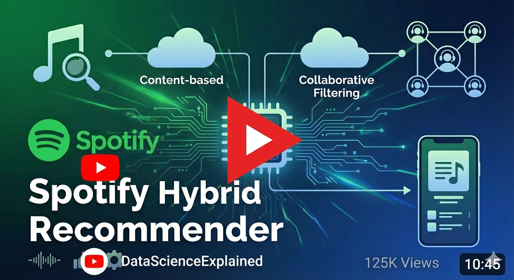

<h1 align="center">🎵 Spotify Hybrid Music Recommendation System</h1>

  
  
  
  
  

A <strong>production-ready Hybrid Music Recommendation System</strong> combining
<strong>Content-Based Filtering</strong> and <strong>Collaborative Filtering</strong>,
deployed using <strong>Streamlit</strong>, <strong>Docker</strong>, <strong>AWS</strong>,
and a fully automated <strong>CI/CD pipeline</strong>.

## 🎥 Project Demo

Watch the 4-minute end-to-end demo of the **Spotify Hybrid Recommendation System** by clicking the thumbnail below:

> ▶️ Click the image to watch the demo on YouTube

<h2>🚀 Project Overview</h2>

This project builds an <strong>end-to-end music recommendation engine</strong> that learns
from both <strong>song metadata</strong> and <strong>user listening behavior</strong>.
By combining multiple recommendation strategies, the system delivers
<strong>accurate, personalized recommendations</strong> and follows modern
<strong>MLOps & deployment best practices</strong>.

<h2>🧠 Recommendation Techniques</h2>

<h3>🎼 Content-Based Filtering</h3>
<ul>
  <li>🎧 Audio features & song metadata</li>
  <li>📝 TF-IDF vectorization on tags</li>
  <li>⚖️ Feature scaling & encoding</li>
  <li>📐 Cosine similarity-based recommendations</li>
</ul>

<h3>👥 Collaborative Filtering</h3>
<ul>
  <li>👤 User–song interaction matrix</li>
  <li>⚡ Built using <strong>Dask</strong> for large-scale data</li>
  <li>🧮 Sparse matrix representation</li>
  <li>🔗 Track-to-track similarity</li>
</ul>

<h3>🔀 Hybrid Recommendation</h3>

Combines both strategies using weighted similarity scores:

<pre>
Final Score = (α × Content Similarity) + ((1 − α) × Collaborative Similarity)
</pre>

<h2>🗂️ Project Structure</h2>

<pre>
├── data/
│   ├── Music Info.csv
│   ├── User Listening History.csv
│   ├── cleaned_data.csv
│   ├── collab_filtered_data.csv
│   ├── interaction_matrix.npz
│   ├── transformed_data.npz
│   └── track_ids.npy
│
├── data_cleaning.py
├── content_based_filtering.py
├── collaborative_filtering.py
├── hybrid_recommendation.py
├── app.py
│
├── EDA_Spotify.ipynb
├── Spotify_content_based_filtering.ipynb
├── Spotify_collaborative_filtering.ipynb
│
├── Dockerfile
├── requirements.txt
├── .github/workflows/ci-cd.yml
└── README.md
</pre>

<h2>⚙️ Tech Stack</h2>

  

<ul>
  <li>Python, Pandas, NumPy</li>
  <li>Dask, Scikit-learn, SciPy</li>
  <li>Streamlit</li>
  <li>Docker & GitHub Actions</li>
  <li>AWS (EC2, ECR, IAM)</li>
</ul>

<h2>🧹 Data Cleaning</h2>

<pre>python data_cleaning.py</pre>

<ul>
  <li>🧼 Removes duplicates</li>
  <li>❓ Handles missing values</li>
  <li>🔤 Standardizes text columns</li>
</ul>

<h2>🎼 Content-Based Filtering</h2>

<pre>python content_based_filtering.py</pre>

<ul>
  <li>Feature engineering on audio & metadata</li>
  <li>TF-IDF for tags</li>
  <li>Saved transformed sparse matrix</li>
</ul>

<h2>👥 Collaborative Filtering</h2>

<pre>python collaborative_filtering.py</pre>

<ul>
  <li>User–track interaction matrix</li>
  <li>Scalable processing using Dask</li>
  <li>Efficient sparse matrix storage</li>
</ul>

<h2>🎛️ Streamlit Application</h2>

<h3>▶️ Run Locally</h3>

<pre>streamlit run app.py --server.port 8000</pre>

<strong>Access:</strong> http://localhost:8000

<h2>🐳 Dockerized Application</h2>

<pre>
docker build -t hybrid-recommender .
docker run -p 8000:8000 hybrid-recommender
</pre>

<ul>
  <li>Same container runs locally & on AWS</li>
  <li>Ensures environment consistency</li>
</ul>

<h2>🔄 CI/CD Pipeline</h2>

🚀 Fully automated CI/CD using <strong>GitHub Actions</strong> and <strong>AWS</strong>

<ul>
  <li>Triggered on every git push</li>
  <li>Automated testing with pytest</li>
  <li>Docker image pushed to Amazon ECR</li>
  <li>Auto deployment to AWS EC2</li>
</ul>

<h2>🧾 CI/CD Architecture</h2>

<pre class="mermaid">
flowchart LR
    A[Developer Push] --> B[GitHub Repo]
    B --> C[GitHub Actions]
    C --> D[Tests & Build]
    D --> E[Docker Image]
    E --> F[AWS ECR]
    F --> G[AWS EC2]
    G --> H[Streamlit App Live]
</pre>

<h2>☁️ AWS Services</h2>

<table>
<tr><th>Service</th><th>Purpose</th></tr>
<tr><td>EC2</td><td>Streamlit hosting</td></tr>
<tr><td>ECR</td><td>Docker image registry</td></tr>
<tr><td>IAM</td><td>Secure access</td></tr>
<tr><td>AWS CLI</td><td>Deployment automation</td></tr>
</table>

<h2>🔐 Security Best Practices</h2>

<ul>
  <li>🔒 No hardcoded credentials</li>
  <li>🛡️ IAM-based access control</li>
  <li>🔑 GitHub Secrets</li>
  <li>📦 Isolated Docker containers</li>
</ul>

<h2>🌟 Key Highlights</h2>

<ul>
  <li>End-to-end hybrid recommender</li>
  <li>Scalable Dask-based processing</li>
  <li>Cloud-deployed Streamlit app</li>
  <li>Production-grade CI/CD pipeline</li>
</ul>

<h2>🚧 Future Improvements</h2>

<ul>
  <li>User-based collaborative filtering</li>
  <li>Real-time recommendations</li>
  <li>Monitoring & logging</li>
  <li>Kubernetes deployment</li>
</ul>

